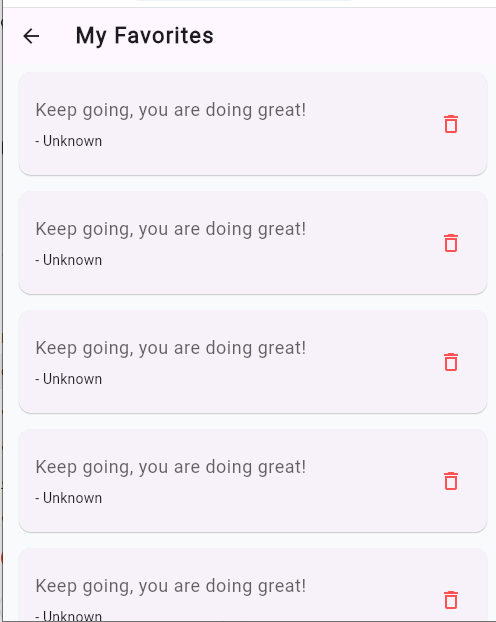

# Random Quote Generator

A modern Flutter application that displays inspiring random quotes with a beautiful glassmorphism UI.

## Features

* Generate random quotes instantly
* Save favorite quotes
* Copy quotes to clipboard
* Share quotes with friends
* Beautiful Glassmorphism design
* State management using Bloc/Cubit
* Local storage for favorites

### Home Screen


### Favorites Screen



## Technologies Used

* Flutter
* Dart
* Flutter Bloc
* SharedPreferences
* Clean Architecture

## Project Structure

```text
lib/
├── core/
├── features/
│   └── quotes/
│       ├── data/
│       ├── domain/
│       └── presentation/
└── main.dart
```

## Installation

1. Clone the repository

```bash
git clone https://github.com/kholod27112003-afk/codealpha_random_quote_generator.git
```

2. Install dependencies

```bash
flutter pub get
```

3. Run the application

```bash
flutter run
```

## Author

Kholod Ali

## Repository

https://github.com/kholod27112003-afk/codealpha_random_quote_generator
